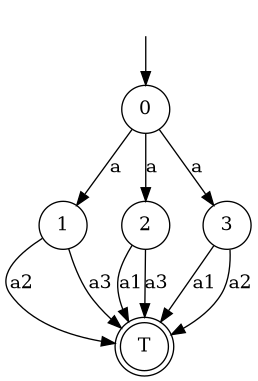

# A family of uncontrollable NFAs

Each automaton in this family is a bottleneck of capacity n, facilitated by $O(n)$ states and actions.  
The idea is to let all processes go to one of $n+1$ distinct nodes; afterwards, one has to play an action $aj$
identifying a node $j$ that is not occupied. This move wins, any other loses.



All of these models are **not** congrollable for arbitrary number of processes, but the $n$-fold product of the size-$m$ model is controllable iff $n\le m$.

## Generate model files

Starting in shepherd's main directory, run the python script to generate 10 models.

```console
cd examples/guess-empty-n 
./generate_models.py 10

ls
nfa-10.dot  nfa-2.dot  nfa-4.dot  nfa-6.dot  nfa-8.dot  generate_models.py
nfa-1.dot   nfa-3.dot  nfa-5.dot  nfa-7.dot  nfa-9.dot
```

## Solve them using prism

```console
time ./target/release/schaeppert -f dot examples/guess-empty-n/nfa-5.dot iterate tmp/
n=1 -> 1.000
n=2 -> 1.000
n=3 -> 1.000
n=4 -> 1.000
n=5 -> 0.962
The value is less than 1.0, stopping the search.
The 5-fold power of this NFA is not controllable.

./target/release/schaeppert -f dot examples/guess-empty-n/nfa-5.dot    5.82s user 0.33s system 216% cpu 2.847 total
```


## Solve them using shepherd


```console
 time ./target/release/shepherd -f dot examples/guess-empty-n/nfa-5.dot 

Maximal winning strategy;
Answer:
	NO (uncontrollable)

States: ( 3 , 2 , 0 , T , 4 , 1 , 5 )
 Play action 'a' in the downward-closure of
	( _ , _ , 4 , _ , _ , _ , _ )


Play action 'a1' in the downward-closure of
	( ω , ω , _ , _ , ω , _ , ω )


Play action 'a2' in the downward-closure of
	( ω , _ , _ , _ , ω , ω , ω )


Play action 'a3' in the downward-closure of
	( _ , ω , _ , _ , ω , ω , ω )


Play action 'a4' in the downward-closure of
	( ω , ω , _ , _ , _ , ω , ω )


Play action 'a5' in the downward-closure of
	( ω , ω , _ , _ , ω , ω , _ )


./target/release/shepherd -f dot examples/guess-empty-n/nfa-5.dot  0.37s user 0.06s system 175% cpu 0.248 total
```
