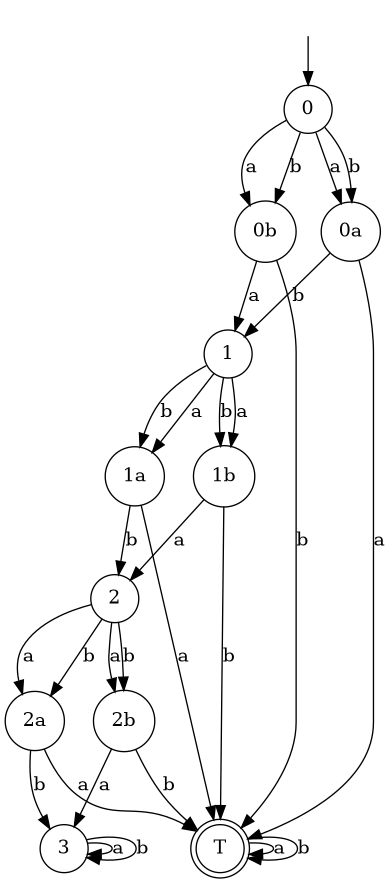

# A family of uncontrollable NFAs

Each automaton in this family is a chain of diamonds where after a split, controller can move a majority of the population into the target and moves the rest to the next round. The last round is a bad sink.



All of these models are **not** congrollable for arbitrary number of processes, but in the size-$n$ chain one can control $\le 2^n$ tokens.

## Generate model files

Starting in shepherd's main directory, run the python script to generate 10 models.

```console
./generate_models.py 10
nfa-10.dot  nfa-2.dot  nfa-4.dot  nfa-6.dot  nfa-8.dot  generate_models.py
nfa-1.dot   nfa-3.dot  nfa-5.dot  nfa-7.dot  nfa-9.dot
```

## Solve them using prism

This assumes the `schaeppert` binary is in your PATH, which can be done by running `cargo install --path .`

```console
schaeppert -f dot nfa-3.dot iterate tmp/ 
n=1 -> 1.000
n=2 -> 1.000
n=3 -> 1.000
n=4 -> 1.000
n=5 -> 1.000
n=6 -> 1.000
n=7 -> 1.000
n=8 -> 0.949
The value is less than 1.0, stopping the search.
The 8-fold power of this NFA is not controllable.
```


## Solve them using shepherd


```console
shepherd -f dot nfa-2.dot 

Maximal winning strategy;
Answer:
	NO (uncontrollable)

States: ( 1a , 0a , T , 1 , 0b , 2 , 1b , 0 )
 Play action 'a' in the downward-closure of
	( ω , ω , ω , 1 , 1 , _ , _ , 1 )
	( ω , ω , ω , _ , 1 , _ , _ , 3 )


Play action 'b' in the downward-closure of
	( _ , 1 , ω , 1 , ω , _ , ω , 1 )
	( _ , 1 , ω , _ , ω , _ , ω , 3 )
```
